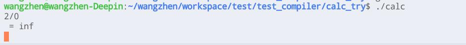
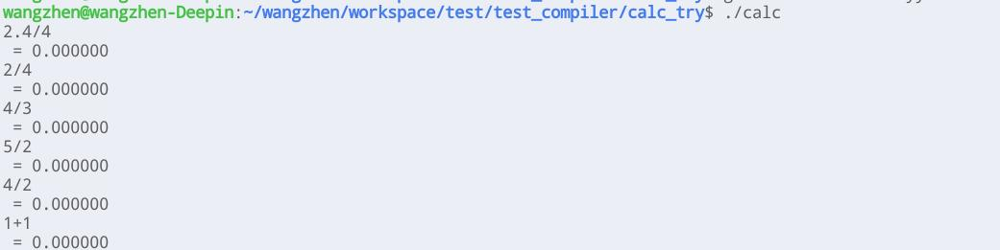
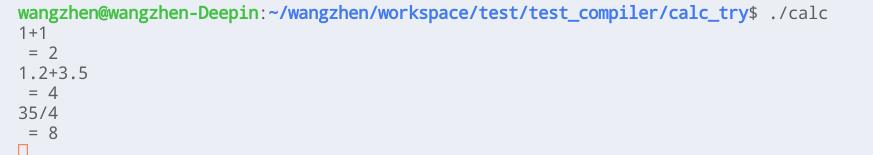
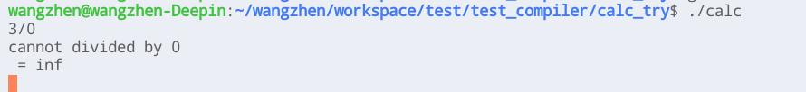
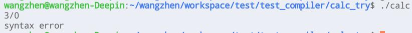

# lab1 实验报告
PB19000078 汪震

## 实验要求
1. 完善`src/parser/lexical_analyzer.l` 和 `src/parser/syntax_analyzer.y`。
2. lexer可以正确识别词素，如识别出if, else等关键字，+, -等运算符，<, >等关系符，id等正则表达式。以及维护pos_start, pos_end, lines，正确标出词素位置。特别是注释的处理，注释可能跨多行，上述3个变量的维护较其他词素麻烦。
3. parser能够正确分析语法，构造出语法树。

## 实验难点
1. 对于flex和bison语法规范不清楚，比如.l文件中的正则表达式里，不能用空格分割。
2. 刚做实验时，不清楚需要如何修改，flex需要识别什么，需要进行什么操作，需要返回什么值。以及bison语法树如何构建也是一头雾水。(不过做起来之后发现，类似无脑地简单重复性操作)

## 实验设计
先在.y文件中，给出union定义。再根据给出的Cminus-f文法，定义出终结符和非终结符，完成相应文法对应的操作，构建语法树。最后在.l文件中完成对终结符的识别，pos_end, pos_start, lines的维护，构建新节点，并返回相应值。

## 实验结果验证
测试文件如下[ex_test.cminus](ex/ex_test.cminus)，一个简单的冒泡排序(不能用for, ++等，好不习惯……)。
```c
void sort(int ar[], int len)
{
    int i, j;
    i = 0;
    while (i < len - 1)
    {
        j = 0;
        while (j < len - i - 1)
        {
            if (ar[j] > ar[j + 1])
            {
                int temp = ar[j];
                ar[j] = ar[j + 1];
                ar[j + 1] = temp;
            }
            j = j + 1;
        }
        i = i + 1;
    }
}
int main()
{
    int ar[10];
    int i = 0;
    while(i < 10)
    {
        ar[i] = 10 - i;
        i = i + 1;
    }
    sort(ar, 10);
    return 0;
}
```

词法分析和语法分析结果如下[lexer_output.txt](ex/lexer_output.txt), [parser_output](ex/parser_output.txt)。都过长，就不在报告中贴出来了。

## 实验反馈
此次实验实际难度不大，主要在于熟悉flex和bison。不过目前做完了也不是特别了解二者的工作原理。还有待后续学习，及在实验中运用，加深理解。

## 思考题讨论
### bison处理左递归
> Bison 是一款解析器生成器（parser generator），它可以将 LALR 文法转换成可编译的 C 代码，从而大大减轻程序员手动设计解析器的负担。
根据[Basics.md](../../Documentations/1-parser/Basics.md)中的这段叙述，可知bison是基于自底向上的移进-规约方式进行语法分析，所以文法中是否存在左递归并无影响。

### yylval协同工作方式
在.y文件中定义了union结构。
```
%union{
    ...
}
```
感觉yylval就类似union定义的一个变量，可以具有union中各种数据的值，不过由于是union，所以同时只具有一种数据类型的值。
另外.y文件中还定义了终结符、非终结符对应的union中类型。在.l文件中，对读取到相应终结符定义了相应操作。这些操作，根据.y文件中定义，将数据存到yylval的不同数据类型中，由于yylval是全局变量，实现属性值的传递。

### 除0 改yylval类型
1. 除0会输出inf，如图
2. 修改yylval类型为int或long，如果不对.l文件进行修改(即将`atof`函数改为`atoi`函数)，由于类型不匹配，无法正确读取输入。如图
   如果一并进行修改(包括输出从`%f`改为`%d`)，将只能进行整数运算，对于小数位进行截断。如图

### 改进计算器文法
除数0**规避**并不明确，是除以0的时候语法出错退出，还是识别出后进行警告，并跳过执行？
不过总体区别不大，修改后的文法: [calc.y](ex/calc.y), [calc.l](ex/calc.l)。
修改部分如下：

```
term
: factor { $$ = $1; }
| term MUL factor { $$ = $1 * $3; }
| term DIV factor_n0 { $$ = $1 / $3; }

factor
: LPAREN expr RPAREN { $$ = $2; }
| NUMBER_0 { $$ = $1; }
| NUMBER_N0 { $$ = $1; }

factor_n0
: LPAREN expr RPAREN { $$ = $2; }
| NUMBER_N0 { $$ = $1; }
| NUMBER_0 { printf("cannot divide 0\n"); }
```
```
[1-9][0-9]*|[1-9][0-9]*\.[0-9]*|[0]*\.[0]*[1-9][0-9]* { yylval.num = atof(yytext); return NUMBER_N0; }
0+|0*\.0+|0+\.0* { yylval.num = atof(yytext); return NUMBER_0; }
```
关键是将非零数的识别和0的各种形式的识别分开，并对除法中的除数采取对0进行特殊操作的非终结符，此处命名为`factor_n0`。
目前这种形式，识别到0后会发出警告，并不退出。但是由于我不了解bison如何跳过后续操作，并没能不进行除法。输出如图
或将`factor_n0`改为如下形式，识别到除数为0时，将发生语法错误，并退出。应该可以做到报错不退出，然而由于不了解bison，还没能做到这一步。
```
factor_n0
: LPAREN expr RPAREN { $$ = $2; }
| NUMBER_N0 { $$ = $1; }
```
输出如图
