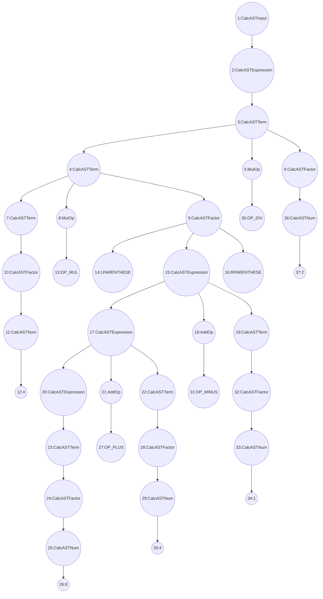
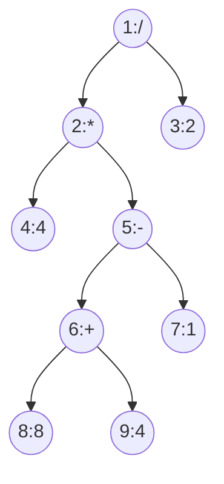

# lab2 实验报告

PB19000078 汪震

## 问题 1: cpp 与 .ll 的对应

请说明你的 cpp 代码片段和 .ll 的每个 BasicBlock 的对应关系。

### 1. [assign_generator.cpp](../../tests/2-ir-gen-warmup/stu_cpp/assign_generator.cpp) [assign_hand.ll](../../tests/2-ir-gen-warmup/stu_ll/assign_hand.ll)

[assign.c](../../tests/2-ir-gen-warmup/c_cases/assign.c)文件中只有一个 `BasicBlock`，下面代码对应 `main` 函数中的 `entry-BasicBlock`。

```c++
//开始main函数
auto mainFun = Function::create(FunctionType::get(Int32Type, {}),
                                    "main", module);
auto bb = BasicBlock::create(module, "entry", mainFun);
builder->set_insert_point(bb);

// BasicBlock entry start from here
......
//取出a[1]的值，并作为返回值返回
auto a1Load = builder->create_load(a1Gep); // get a[1] value
builder->create_ret(a1Load);
// BasicBlock entry end
```

### 2. [fun_gernerator.cpp](../../tests/2-ir-gen-warmup/stu_cpp/fun_generator.cpp) [fun_hand.ll](../../tests/2-ir-gen-warmup/stu_ll/fun_hand.ll)

[fun.c](../../tests/2-ir-gen-warmup/c_cases/fun.c)中有 2 个函数`callee`和`main`，其中均没有分支和循环语句，所以总共 2 个 `BasicBlock`，2 个函数各一个。
下面是`callee`函数的 `BasicBlock`。

```c++
// callee function
// head part of function
std::vector<Type *> Int(1, Int32Type);
auto calleeFunTy = FunctionType::get(Int32Type, Int);
auto calleeFun = Function::create(calleeFunTy, "callee",module);
auto bb = BasicBlock::create(module, "entry", calleeFun);
builder->set_insert_point(bb);

// BasicBlock entry start from here
......
auto aLoad = builder->create_load(aAlloca); // load a
auto mul = builder->create_imul(CONST_INT(2), aLoad); // mul= 2 * a
builder->create_ret(mul);
// BasicBlock entry end
```

下面是 `main` 函数的 `BasicBlock`。

```c++
// main fuction
auto mainFun = Function::create(FunctionType::get(Int32Type,{}),
                                "main", module);
bb = BasicBlock::create(module, "entry", mainFun);
builder->set_insert_point(bb);

// BasicBlock entry start from here
......
auto call = builder->create_call(calleeFun, {CONST_INT(110)};
builder->create_ret(call);
// BasicBlock entry end
```

### 3. [if_generator.cpp](../../tests/2-ir-gen-warmup/stu_cpp/if_generator.cpp) [if_hand.ll](../../tests/2-ir-gen-warmup/stu_ll/if_hand.ll)

[if.c](../../tests/2-ir-gen-warmup/c_cases/if.c)虽然只有一个 `main` 函数，但是其中有 `if` 语句，所以除了 `main` 函数中 1 个基本的 `BasicBlock` 外，还有 3 个 `BasicBlock`，分别对应与于 `if` 判断成功，`if` 判断失败，返回值返回。
首先是 `main` 函数基本的 `BasicBlock`。

```c++
// main function
auto mainFunc = Function::create(FunctionType::get(Int32Type, {}), "main", module);
auto bb = BasicBlock::create(module, "entry", mainFunc);
builder->set_insert_point(bb);
// BasicBlock entry start from here
......
auto icmp = builder->create_fcmp_gt(aLoad, CONST_FP(1.0));
auto trueBranch = BasicBlock::create(module, "trueBranch", mainFunc);
auto falseBranch = BasicBlock::create(module, "falseBranch",mainFunc);
auto retBranch = BasicBlock::create(module, "retBranch", mainFunc);
builder->create_cond_br(icmp, trueBranch, falseBranch);
// BasicBlock entry end
```

在`icmp`进行判断后，创建了 3 个`BasicBlock`: `trueBranch`, `falseBranch`, `retBranch`([if_hand.ll](../../tests/2-ir-gen-warmup/stu_ll/if_hand.ll)中分别为`6`, `7`, `8`)。之后创建分支语句，根据`icmp`的值，跳转到不同的`BasicBlock`。

之后是`trueBranch-BasicBlock`

```c++
// true branch
// BasicBlock trueBranch start from here
builder->set_insert_point(trueBranch);
builder->create_store(CONST_INT(233), retAlloca);
builder->create_br(retBranch);
// BasicBlock trueBranch end
```

`trueBranch`结束时，无条件跳转到`retBranch-BasicBlock`。

然后是`falseBranch-BasicBlock`

```c++
// false branch
// BasicBlock falseBranch start from here
builder->set_insert_point(falseBranch);
builder->create_store(CONST_INT(0), retAlloca);
builder->create_br(retBranch);
// BasicBlock falseBranch end
```

`falseBranch`结束时，与`trueBranch`一样，无条件跳转到`retBranch-BasicBlock`。

最后是`retBranch-BasicBlock`

```c++
// return branch
// BasicBlock retBranch start from here
builder->set_insert_point(retBranch);
auto retLoad = builder->create_load(retAlloca); //load return value
builder->create_ret(retLoad);
// BasicBlock retBranch end
```

### 4. [while_generator.cpp](../../tests/2-ir-gen-warmup/c_cases/while.c) [while_hand.ll](../../tests/2-ir-gen-warmup/stu_ll/while_hand.ll)

和[if.c](../../tests/2-ir-gen-warmup/c_cases/if.c)一样，[while.c](../../tests/2-ir-gen-warmup/c_cases/while.c)虽然只有一个 `main` 函数，但是内部有 `while` 循环语句，导致除了进入 `main` 函数后固有的 1 个 `BasicBlock` 外，还有 3 个 `BasicBlock`，分别用于循环条件判断，循环内部执行语句，退出循环后的语句。
首先是进入 `main` 函数后的 `BasicBlock`。

```c++
auto mainFunc = Function::create(FunctionType::get(Int32Type, {}), "main", module);
auto bb = BasicBlock::create(module, "entry", mainFunc);
builder->set_insert_point(bb);
// BasicBlock entry start from here
......

auto judgeBlock = BasicBlock::create(module,"judgeBlock", mainFunc);
auto whileBlock = BasicBlock::create(module,"whileBlock", mainFunc);
auto retBlock = BasicBlock::create(module, "retBlock",mainFunc);
builder->create_br(judgeBlock);
// BasicBlock entry end
```

`entry-BasicBlock`末尾，创建了 3 个`BasicBlock`: `judgeBlock`, `whileBlock`, `retBlock`([while_hand.ll](../../tests/2-ir-gen-warmup/stu_ll/while_hand.ll)中分别为`4`, `7`, `12`)。之后创建分支语句，无条件跳转到`judgeBlock`，进行 `while` 语句的循环条件判断。

其次是`judgeBlock-BasicBlock`。

```c++
// judge block
builder->set_insert_point(judgeBlock);
// BasicBlock judgeBlock start from here
auto iLoad = builder->create_load(iAlloca); // load ivalue
auto icmp = builder->create_icmp_lt(iLoad, CONST_INT(10));
builder->create_cond_br(icmp, whileBlock, retBlock);
// BasicBlock judgeBlock end
```

`icmp`进行条件判断，之后根据判断结构，跳转到`whileBlock`或者`retBlock`。

再次是`whileBlock`。

```c++
// while block
builder->set_insert_point(whileBlock);
// BasicBlock whileBlock start from here
auto iLoad_2 = builder->create_load(iAlloca); // load i value
auto add = builder->create_iadd(iLoad_2, CONST_INT(1));
builder->create_store(add, iAlloca);    // i = i + 1
auto aLoad = builder->create_load(aAlloca); // load a value
auto add_2 = builder->create_iadd(aLoad, add); // a = a + i
builder->create_store(add_2, aAlloca);
builder->create_br(judgeBlock);
// BasicBlock whileBlock end
```

`whileBlock`结束时，无条件跳转到`judgeBlock`，进行判断，决定是否继续执行循环。

最后是`retBlock`。

```c++
// return block
builder->set_insert_point(retBlock);
// BasicBlock retBlock start from here
auto aLoad_2 = builder->create_load(aAlloca); // load a value
builder->create_ret(aLoad_2);
// BasicBlock retBlock end
```

## 问题 2: Visitor Pattern

分析 `calc` 程序在输入为 `4 * (8 + 4 - 1) / 2` 时的行为：

1. 请画出该表达式对应的抽象语法树（使用 `calc_ast.hpp` 中的 `CalcAST*` 类型和在该类型中存储的值来表示），并给节点使用数字编号。
<details>
<summary>分析树(一开始画错了，就留着了)</summary>



</details>

<details>
<summary>AST</summary>

```mermaid
graph TB
1:CalcASTTerm.op=MulOP::OP_DIV((1:CalcASTTerm.op=MulOP::OP_DIV))
2:CalcASTTerm.op=MulOP::OP_MUL((2:CalcASTTerm.op=MulOP::OP_MUL))
3:CalcASTNum.val=2((3:CalcASTNum.val=2))
4:CalcASTNum.val=4((4:CalcASTNum.val=4))
5:CalcASTExpression.op=AddOp::OP_MINUS((5:CalcASTExpression.op=AddOp::OP_MINUS))
6:CalcASTExpression.op=AddOp::OP_PLUS((6:CalcASTExpression.op=AddOp::OP_PLUS))
7:CalcASTNum.val=1((7:CalcASTNum.val=1))
8:CalcASTNum.val=8((8:CalcASTNum.val=8))
9:CalcASTNum.val=4((9:CalcASTNum.val=4))

1:CalcASTTerm.op=MulOP::OP_DIV --> 2:CalcASTTerm.op=MulOP::OP_MUL
1:CalcASTTerm.op=MulOP::OP_DIV --> 3:CalcASTNum.val=2
2:CalcASTTerm.op=MulOP::OP_MUL --> 4:CalcASTNum.val=4
2:CalcASTTerm.op=MulOP::OP_MUL --> 5:CalcASTExpression.op=AddOp::OP_MINUS
5:CalcASTExpression.op=AddOp::OP_MINUS --> 6:CalcASTExpression.op=AddOp::OP_PLUS
5:CalcASTExpression.op=AddOp::OP_MINUS --> 7:CalcASTNum.val=1
6:CalcASTExpression.op=AddOp::OP_PLUS --> 8:CalcASTNum.val=8
6:CalcASTExpression.op=AddOp::OP_PLUS --> 9:CalcASTNum.val=4
```



</details>

1. 请指出示例代码在用访问者模式遍历该语法树时的遍历顺序。

序列请按如下格式指明（序号为问题 2.1 中的编号）：  
3->2->5->1

`calc_builder.cpp`中，均为先访问左右结点，再`switch(node.op)`，所以从遍历顺序上来说，`node.op`在左右结点之后。(实际上从`calc_ast.cpp`里面的`transform_node_iter`函数来看，顺序是先建了左孩子，再确定`op`，最后是右孩子，顺序不太一样)
4->8->9->6->7->5->2->3->1
(值的顺序是 4 -> 8 -> 4 -> + -> 1 -> - -> \* -> 2 -> /)

## 问题 3: getelementptr

请给出 `IR.md` 中提到的两种 getelementptr 用法的区别,并稍加解释:

- `%2 = getelementptr [10 x i32], [10 x i32]* %1, i32 0, i32 0`
- `%2 = getelementptr i32, i32* %1 i32 0`

类似C中指针和数组名的区别。将getelementptr用于有确定范围的数组，需要明确指出数组的大小，以及起始数组下标，需要得到的指针对应的数组下标。分别对应于上面例子中的`[10 × i32]`, `i32 0`(前), `i32 %0`(后)。而用于指针时，只需说明指针指向的类型，指针的类型，以及待求指针的相对偏移，对应于上面例子中的`i32`, `i32*`, `i32 0`。
主要是数据类型不同，`%2 = getelementptr [10 x i32], [10 x i32]* %1, i32 0, i32 0`中的`%1`，是分配出的`[10 × i32]`数组，即前面存在语句`%1 = alloca [10 × i32]`，所以`getelementptr`需要符合操作数类型，使用`[10 × i32]`，并指出起始位置`i32 0`。
而`%2 = getelementptr i32, i32* %1 i32 0`中的`%1`则是直接定义的指针，或函数传入的指针参数之类，并非直接分配空间的数组，即前面可能存在语句`%1 = load i32*, i32** %3`，将指针`%3`的地址赋给`%1`，再`%2 = getelementptr i32, i32* %1 i32 0`，`%2`获得相对于`%1`偏移一定地址的指针。
本质上并无太大区别，`getelementptr`功能就是根据给定指针，基于偏移，算出新地址。

## 实验难点
1. llvm中间代码语法陌生，写.ll文件时存在一定困难。参考给的例子`gcd_array.ll`，了解函数怎么定义，变量怎么分配空间，if、while语句可以怎么写，`getelementptr`如何使用等，写一两个例子之后基本就熟悉了，再就照葫芦画瓢。
2. 写`*_generator.cpp`的时候不太熟悉。一方面是初次接触`ligntir`，对接口不了解，看代码存在一定难度。解决办法和1中差不多，就是对着`gcd_array_generator.cpp`的例子看，大致模仿，基本就能解决，还是熟能生巧的问题。

## 实验反馈
总体来说，这次实验难度不太大，主要是熟悉lightIR接口、llvm IR。
建议把实验文档中lightIR的注释加到代码里，文档里有注释，代码里却没有，挺奇怪的。
以及像[gcd_array_generator.cpp](../../tests/2-ir-gen-warmup/ta_gcd/gcd_array_generator.cpp#55)中55-57行，可以考虑用`for_each`，即改为
```c
for_each(gcdFun->arg_begin(), gcdFun->arg_end(), [&](auto& arg)
           { args.push_back(arg); });
```
实际上没什么区别，更紧凑些(可能效率会更高些?)。